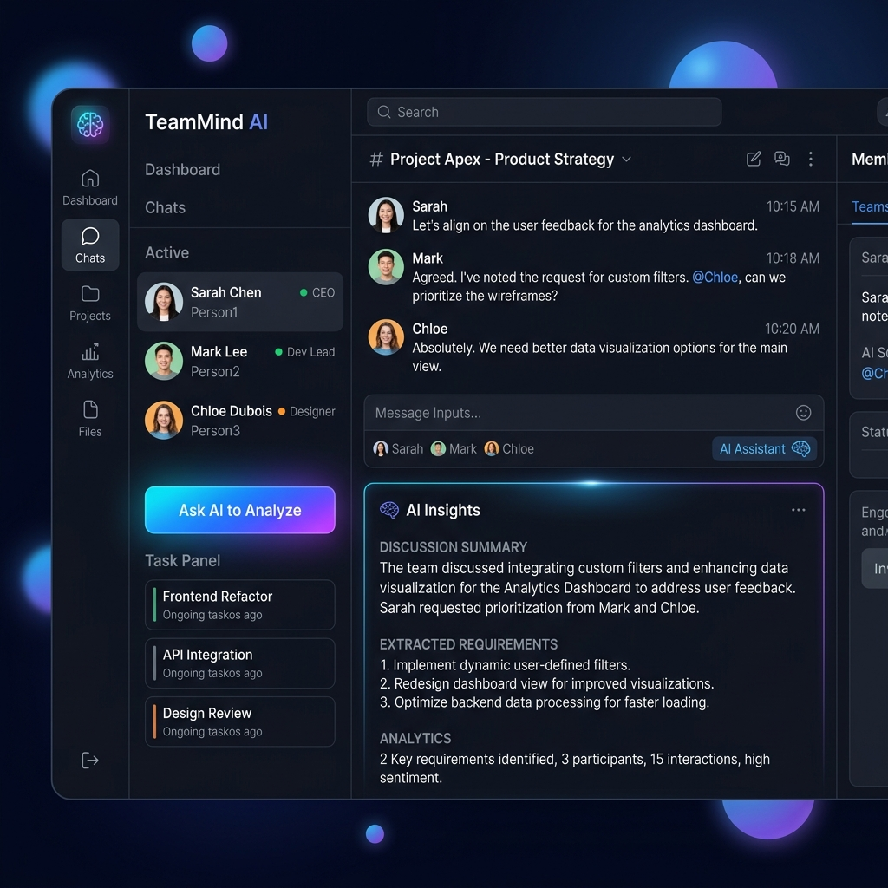

<p align="center">
  
</p>

<h1 align="center">🧠 TeamMind AI</h1>

<p align="center">
  <strong>AI-Powered Team Collaboration & Requirements Analyzer</strong><br/>
  Your team discusses → AI organizes everything into requirements, tasks & documentation.
</p>

<p align="center">
  
  
  
  
  
</p>

---

## ✨ What is TeamMind AI?

**TeamMind AI** is a real-time team collaboration platform where multiple team members can have a discussion — and then an AI agent analyzes the entire conversation to automatically extract:

- 📋 **Requirements** from the discussion
- 📌 **Actionable Tasks** for the team
- 📄 **Auto-Generated Documentation** — a project brief from the conversation
- 📊 **Conversation Stats** — message counts, participant tracking

> **Think of it as:** Slack meets an AI Project Manager — your team talks, and AI does the organizing.

---

## 🚀 Features

| Feature | Description |
|---------|-------------|
| 🧑‍🤝‍🧑 **Multi-User Chat** | Switch between 3 team roles (Business Analyst, Developer, DevOps Engineer) and chat |
| 🧠 **AI Analysis** | One-click AI analysis that processes the entire team discussion |
| 📋 **Requirement Extraction** | Automatically identifies requirements from natural conversation |
| 📌 **Task Generation** | Creates actionable tasks based on extracted requirements |
| 📄 **Auto Documentation** | Generates a project brief with team members, requirements, and discussion log |
| 💬 **Chat History** | Persistent message history stored in JSON |
| 🗑️ **Clear History** | One-click reset for new discussions |
| 🎨 **Premium UI** | Dark glassmorphism design with animated backgrounds and smooth micro-animations |

---

## 📸 Screenshots

<p align="center">
  
</p>

---

## 🏗️ Project Structure

```
teammind-ai/
├── backend/
│   ├── main.py          # FastAPI server — routes & API endpoints
│   ├── ai.py            # AI analysis engine — requirement extraction & task generation
│   └── memory.py        # Chat memory — JSON-based persistence layer
├── frontend/
│   └── index.html       # Complete SPA — chat UI with glassmorphism design
├── data/
│   └── chat.json        # Chat history (auto-generated)
├── requirements.txt     # Python dependencies
├── .gitignore           # Git exclusions
└── README.md            # You are here!
```

---

## ⚡ Quick Start

### Prerequisites

- **Python 3.8+** installed
- **pip** (Python package manager)

### 1️⃣ Clone the Repository

```bash
git clone https://github.com/YOUR_USERNAME/teammind-ai.git
cd teammind-ai
```

### 2️⃣ Install Dependencies

```bash
pip install -r requirements.txt
```

### 3️⃣ Start the Server

```bash
cd backend
python -m uvicorn main:app --reload --port 8000
```

### 4️⃣ Open in Browser

Navigate to **[http://localhost:8000](http://localhost:8000)** — and you're live! 🎉

---

## 🎯 How to Use

1. **Select your identity** from the sidebar (Person1, Person2, or Person3)
2. **Type your ideas** in the chat — discuss features, requirements, problems
3. **Switch users** to simulate different team members contributing
4. **Click "🧠 Ask AI to Analyze"** when the discussion has enough context
5. **View the results:**
   - 💬 Discussion summary per team member
   - 📋 Extracted requirements with attribution
   - 📌 Generated task list in the sidebar
   - 📊 Conversation statistics

---

## 🔌 API Endpoints

| Method | Endpoint | Description |
|--------|----------|-------------|
| `GET` | `/` | Serves the frontend UI |
| `GET` | `/history` | Returns all chat messages |
| `POST` | `/chat` | Sends a new team member message |
| `POST` | `/ask-ai` | Triggers AI analysis of the conversation |
| `DELETE` | `/clear` | Clears all chat history |

### Example: Send a Message

```bash
curl -X POST http://localhost:8000/chat \
  -H "Content-Type: application/json" \
  -d '{"user": "Person1", "role": "business", "content": "We need a login page"}'
```

### Example: Trigger AI Analysis

```bash
curl -X POST http://localhost:8000/ask-ai
```

---

## 🛠️ Tech Stack

| Layer | Technology |
|-------|-----------|
| **Backend** | Python, FastAPI, Uvicorn |
| **Frontend** | HTML5, CSS3, Vanilla JavaScript |
| **AI Engine** | Custom NLP-based analysis (no external API keys needed!) |
| **Data Storage** | JSON file-based persistence |
| **Design** | Glassmorphism, CSS animations, Inter font |

---

## 🤖 How the AI Works

TeamMind AI uses a **rule-based NLP engine** (no API keys required!) that:

1. **Filters** out greetings and filler messages (hi, hello, ok, etc.)
2. **Groups** messages by team member and role
3. **Extracts** substantive requirements from the discussion
4. **Generates** actionable tasks from the requirements
5. **Creates** a project brief document with all the organized data

> 💡 **No external AI API needed** — the analysis runs entirely locally!

---

## 🎨 Design Highlights

- **Dark Mode** — Easy on the eyes with a `#0a0e1a` base
- **Glassmorphism** — Frosted glass panels with `backdrop-filter: blur(20px)`
- **Animated Orbs** — Floating gradient spheres in the background
- **Micro-Animations** — Smooth message entry, hover effects, typing indicators
- **Color-Coded Roles** — Blue (Business), Purple (Developer), Green (DevOps), Amber (AI)
- **Responsive** — Adapts to mobile with sidebar collapse

---

## 📝 License

This project is licensed under the **MIT License** — feel free to use, modify, and distribute.

---

## 🤝 Contributing

Contributions are welcome! Feel free to:

1. Fork the repository
2. Create a feature branch (`git checkout -b feature/amazing-feature`)
3. Commit your changes (`git commit -m 'Add amazing feature'`)
4. Push to the branch (`git push origin feature/amazing-feature`)
5. Open a Pull Request

---

## 🌟 Star This Repo

If you found this project useful, give it a ⭐ on GitHub — it helps a lot!

---

<p align="center">
  Made with ❤️ by <strong>TeamMind AI</strong>
</p>
